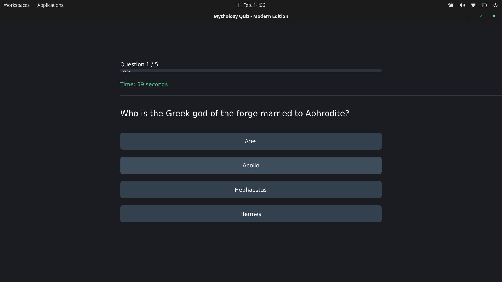

# Mythology Quiz – Modern Edition

[](LICENSE)
[](https://github.com/Xyt564/mythologyquiz-game/releases)

A sleek, modern **Greek and Roman mythology quiz** built with **C++** and **Dear ImGui**, featuring smooth animations, adaptive UI, and a polished look. Test your knowledge with up to **50 questions**!

---

## Features

* **50 questions** on Greek and Roman mythology
* Smooth **animations**: fade, slide, and pulsing effects
* Modern **dark color scheme** with clean UI
* **Responsive layout** that adapts to your screen resolution
* Automatic **OS detection**: Linux, macOS, and Windows (Windows requires manual setup)
* **Timer** with color-coded urgency
* Detailed **results** with correct answers and performance feedback

---

## Requirements

* **C++17** compiler
* **OpenGL 3.3+**
* **GLFW** library
* **Dear ImGui** library
* **Linux, macOS, or Windows**

> On Linux and macOS, `setup.sh` handles all dependencies automatically (tested on Debian/Ubuntu, Fedora, Arch, and Mac).

---

## Getting Started

### Option 1 – Pre-compiled release (recommended)

If you prefer **not to compile the application**, you can download the **pre-compiled version** from the [Releases](https://github.com/Xyt564/mythologyquiz-game/releases) section.

For Linux and macOS:

```bash
chmod +x mythologyquiz
./mythologyquiz
```

This ensures a smooth setup without building the project from source.

---

### Option 2 – Compile from source

1. Clone the repository:

```bash
git clone https://github.com/Xyt564/mythologyquiz-game.git
cd mythologyquiz-game
```

2. Make the setup script executable and run it:

```bash
chmod +x setup.sh
./setup.sh
```

This script will:

* Install all necessary dependencies
* Compile the project
* Generate a `launch.sh` script

3. Run the quiz:

```bash
./launch.sh
```

> The app will detect your screen resolution and adjust the layout for optimal display.
> On Windows, you will need to install dependencies manually and compile the project yourself.

---

## How to Play

1. Choose the number of questions (5, 10, 15, 25, or 50)
2. Answer each question before the timer runs out
3. After finishing, view your results:

   * Quick summary with your score
   * Detailed breakdown with your answers vs correct answers
4. Return to the menu to play again

---

## Screenshots



---

## File Structure

```
mythologyquiz-game/
├── main.cpp          # Main application
├── setup.sh          # Installs dependencies and compiles project
├── launch.sh         # Launches the quiz
├── README.md         # This file
├── CMakeLists.txt    # CMake build file
├── ImGui/            # Dear ImGui repository
└── Build/            # Build folder containing compiled application
```

---

## License

This project is licensed under the **MIT License** – see the [LICENSE](LICENSE) file for details.

```
MIT License

Copyright (c) 2026 Xyt564

Permission is hereby granted, free of charge, to any person obtaining a copy
of this software and associated documentation files (the "Software"), to deal
in the Software without restriction, including without limitation the rights
to use, copy, modify, merge, publish, distribute, sublicense, and/or sell
copies of the Software, and to permit persons to whom the Software is
furnished to do so, subject to the following conditions:

The above copyright notice and this permission notice shall be included in all
copies or substantial portions of the Software.

THE SOFTWARE IS PROVIDED "AS IS", WITHOUT WARRANTY OF ANY KIND, EXPRESS OR
IMPLIED, INCLUDING BUT NOT LIMITED TO THE WARRANTIES OF MERCHANTABILITY,
FITNESS FOR A PARTICULAR PURPOSE AND NONINFRINGEMENT. IN NO EVENT SHALL THE
AUTHORS OR COPYRIGHT HOLDERS BE LIABLE FOR ANY CLAIM, DAMAGES OR OTHER
LIABILITY, WHETHER IN AN ACTION OF CONTRACT, TORT OR OTHERWISE, ARISING FROM,
OUT OF OR IN CONNECTION WITH THE SOFTWARE OR THE USE OR OTHER DEALINGS IN THE
SOFTWARE.
```

---
